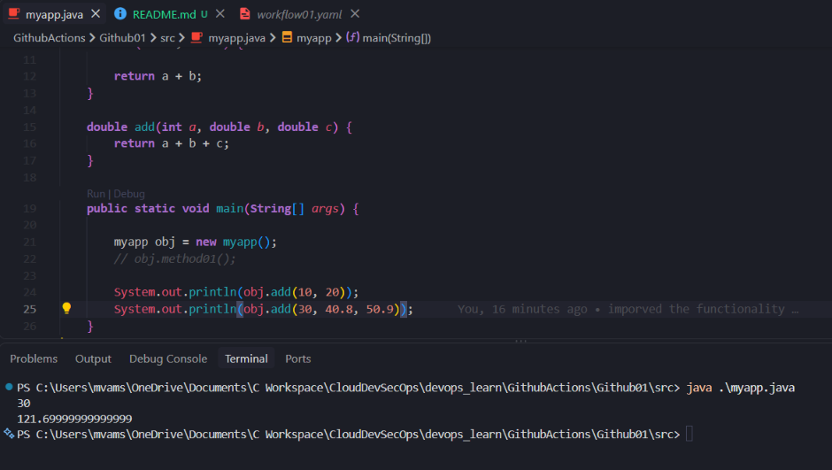
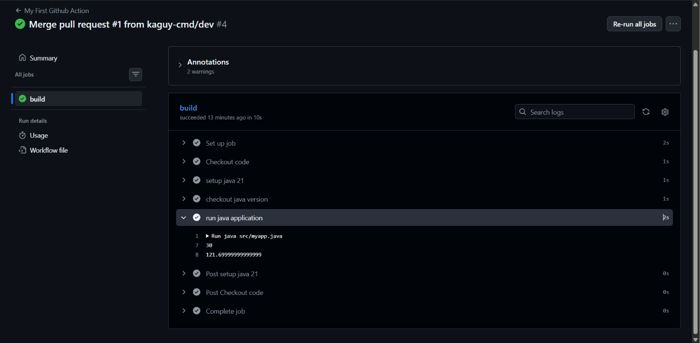
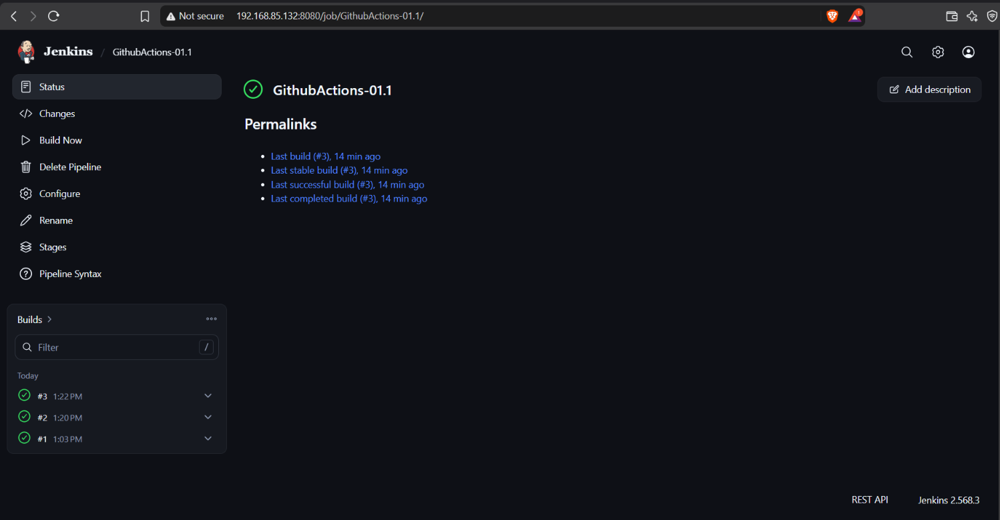
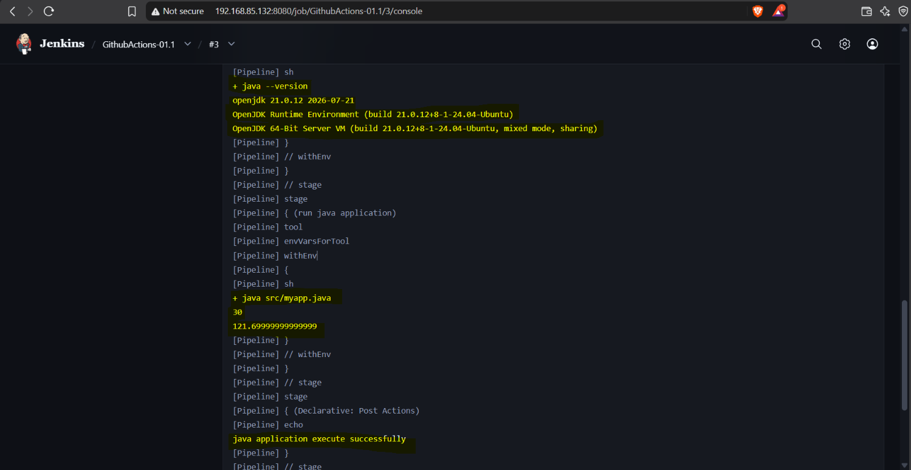

# GitHubActions-01

A lightweight CI/CD demonstration project showcasing automated build and execution pipelines for a **Java 21** application using both **GitHub Actions** and **Jenkins Pipeline**.

<p align="center">
  
  
  
</p>

---

## 📌 Project Overview

This repository demonstrates the setup and execution of continuous integration pipelines for a Java source application across two major CI/CD tools:

1. **GitHub Actions Workflow** (`.github/workflows/workflow01.yaml`):
   - Triggers on `push` and `pull_request` to `main`, and manual dispatch (`workflow_dispatch`).
   - Sets up Eclipse Temurin JDK 21 on `ubuntu-latest`.
   - Verifies runtime version and compiles/executes `src/myapp.java`.

2. **Jenkins Declarative Pipeline** (`Jenkinsfile`):
   - Configures JDK 21 toolchain.
   - Checks out source from SCM, prints Java environment version, and runs the application.
   - Handles post-execution notifications on success/failure.

---

## 📂 Repository Structure

```text
├── .github/
│   └── workflows/
│       └── workflow01.yaml    # GitHub Actions workflow definition
├── images/                    # Execution verification screenshots
├── src/
│   └── myapp.java             # Core Java 21 application
├── Jenkinsfile                # Jenkins declarative pipeline script
└── README.md
```

---

## Getting Started

### Prerequisites
- **Java 21 (JDK 21)** installed locally.

### Local Execution
To run the Java application directly without a build tool:
```bash
java src/myapp.java
```

---

## 📸 Pipeline Execution Previews

|                   **Local Execution**                   |                      **GitHub Actions Run**                      |
| :-----------------------------------------------------: | :--------------------------------------------------------------: |
|  |  |
|             *Running locally via terminal*              |          *Automated workflow passing on Ubuntu runner*           |

|                    **Jenkins Pipeline Status**                    |                     **Jenkins Console Output**                      |
| :---------------------------------------------------------------: | :-----------------------------------------------------------------: |
|  |  |
|              *Build completed on Jenkins dashboard*               |            *Console output validating Java 21 execution*            |

---
<p align="left">
  <a href="https://github.com/vamshikrishnamsiva">
    
  </a>
</p>

---